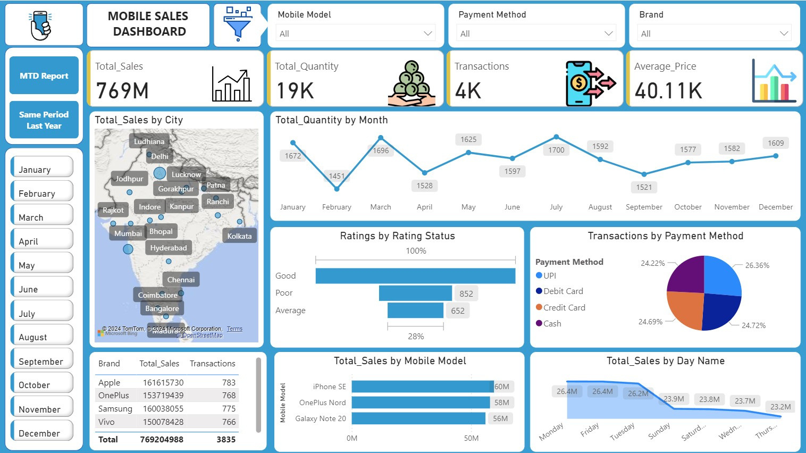

# Vikas Dhakad
---

# 📱 Mobile Sales Dashboard

A Power BI dashboard project that visualizes comprehensive mobile sales data including sales performance, transaction breakdown, and customer ratings across various cities in India.

## 📊 Overview

This interactive dashboard provides insights into:

- **Total Sales**: ₹769M
- **Total Quantity Sold**: 19K units
- **Total Transactions**: 4K
- **Average Price per Unit**: ₹40.11K
- **Top Performing Brands**: Apple, OnePlus, Samsung, Vivo
- **Popular Mobile Models**: iPhone SE, OnePlus Nord, Galaxy Note 20
- **Sales Trends**: Monthly and daily breakdowns
- **Geographical Distribution**: City-wise sales visualization
- **Customer Ratings**: Good, Average, Poor
- **Payment Methods**: UPI, Debit/Credit Cards, and Cash

## 📍 Key Visuals

- **Map**: Sales distribution across Indian cities
- **Line Charts**: Monthly trends in quantity sold
- **Bar Charts**: Top mobile models, brand-wise performance, customer ratings
- **Pie Chart**: Transactions by payment method
- **Day-wise Sales Analysis**

## 🛠️ Tools Used

- Power BI
- DAX
- Power Query
- Microsoft Bing Maps Integration

## 💡 Purpose

To help stakeholders and management:

- Monitor real-time mobile sales metrics
- Understand customer preferences
- Optimize marketing and inventory strategies

## 📂 How to Use

1. Open the `.pbix` file in Power BI Desktop.
2. Connect to your dataset or use the sample data.
3. Interact with filters to explore insights by brand, model, month, or payment method.

---

